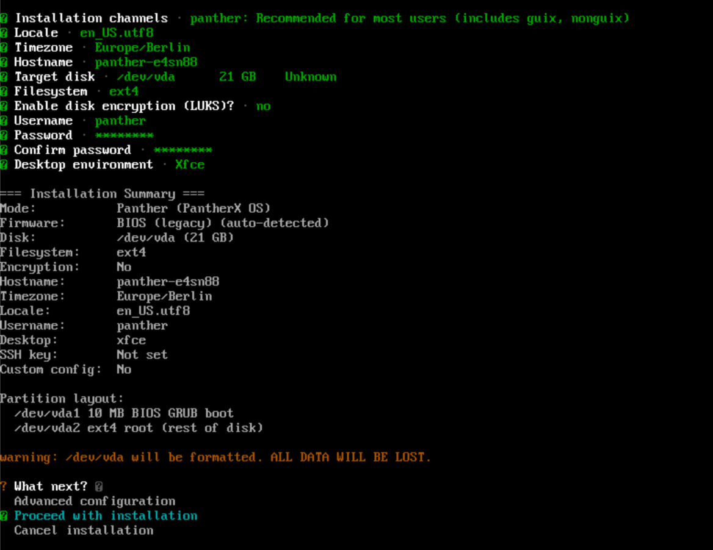

# guix-install

<p align="center">
  
</p>
<p align="center">
  Guix System installer. Boot a Guix ISO, run one binary, get a working system — libre Guix, Nonguix, PantherX, or an enterprise config from a server.
</p>

## Why

The existing Python installer ([`px-install`](https://github.com/franzos/px-install)) had gotten hard to live with — partitioning tangled into config generation, no resume on failure, four modes bolted on with conditionals. Rewrote it in Rust with the install mode as the central axis.

## Status

Pre-1.0. Runs end-to-end on the machines I've tested. **Read what it's about to do before you let it touch your disk.** `--dry-run` prints the generated `system.scm` (+ `channels.scm`) without partitioning anything.

Prebuilt **static x86_64 binaries** (musl, no runtime deps) are attached to each [GitHub release](https://github.com/franzos/guix-install/releases) so you can use this on a plain Guix ISO without building anything.

There's now a **graphical frontend** (`guix-install-gui`) — a second frontend over the exact same install logic, keyboard-first, built on [iced](https://iced.rs). It covers the same modes, steps, and phases as the CLI.

## Modes

| Channel | Kernel | Notes |
|---------|--------|-------|
| [`guix`](https://codeberg.org/guix/guix) | linux-libre | Hardware preflight warns about Wi-Fi/GPU/Ethernet needing non-free firmware. |
| [`nonguix`](https://gitlab.com/nonguix/nonguix) | linux + microcode | `substitutes.nonguix.org` key compiled in. |
| [`panther`](https://codeberg.org/gofranz/panther) *(default)* | linux + microcode | Pulls nonguix transitively. Inherits `%os-base` from `(px system os)`. `substitutes.guix.gofranz.com` key compiled in. |
| `enterprise` | from remote | Fetches a tarball over HTTPS by config ID. Skips locale/timezone/hostname/users/desktop. |

## Build

The project is a Cargo workspace: `guix-install-core` (the library — all the install logic) plus two binaries, `guix-install` (CLI) and `guix-install-gui` (GUI). `manifest.scm` carries everything both need (toolchain, `CC`/`OPENSSL_DIR` exports, and the GUI's Wayland/render libs), so the workspace builds in one shot:

```bash
guix shell -m manifest.scm -- cargo build --release
```

Build a single binary with `-p`. The CLI never pulls in iced, so a CLI-only build (the static-release path) needs nothing from the GUI side:

```bash
guix shell -m manifest.scm -- cargo build --release -p guix-install        # CLI
guix shell -m manifest.scm -- cargo build --release -p guix-install-gui    # GUI
```

## Usage

On the **PantherX ISO** the binary is pre-installed — just run:

```bash
guix-install
```

Latest PantherX ISO (2.2 GB, BIOS + UEFI, x86_64):

```
https://temp.pantherx.org/1xnvrrk5n25llks8pjx64f2kb3nfasn4-image.iso
```

Hash (Guix nix-base32, SHA-256): `0vvnfzw6y52z1qd2k60jcxw9r5y9mfvp9s1p4nj53ii4l3gyhbmg`

On a **plain Guix ISO** (or anywhere else), grab the static musl binary from a release:

```bash
curl -L -o guix-install \
  https://github.com/franzos/guix-install/releases/latest/download/guix-install-x86_64-linux-musl
chmod +x guix-install
./guix-install
```

Walks through Mode → Locale → Timezone → Hostname → Disk → Encryption → Users → Desktop → Summary. Escape goes back a step. Enterprise mode collapses the middle to just Disk + Encryption.

<p align="center">
  
</p>

Dry run (no disk touched):

```bash
guix-install --dry-run --mode nonguix --hostname mybox --disk /dev/sda \
             --filesystem btrfs --encrypt --desktop gnome
```

Common flags:

| Flag | Default | |
|------|---------|---|
| `--mode` | `panther` | `guix`, `nonguix`, `panther`, `enterprise` |
| `--hostname` | `<mode>-<6 random>` | |
| `--timezone` | `Europe/Berlin` | |
| `--locale` | `en_US.utf8` | |
| `--disk` | `/dev/sda` | |
| `--filesystem` | `ext4` | or `btrfs` |
| `--encrypt` | off | LUKS on `/` |
| `--username` | `panther` | login name for the primary user |
| `--keyboard` | none | layout, e.g. `us`, `de` |
| `--desktop` | none | `gnome`, `kde`, `xfce`, `mate`, `sway`, `i3`, `lxqt` |
| `--swap` | `4096` MB | swap file size |
| `--ssh-key` | none | dropped into the user's `authorized_keys` |
| `--config <ID>` | | implies `--mode enterprise` |
| `--config-url` | `https://temp.pantherx.org/install` | enterprise base URL |
| `--dry-run` | off | print scheme, do nothing |

Subcommands:

```bash
guix-install list-disks    # lsblk-style summary
guix-install wifi          # connmanctl WiFi setup
```

## Graphical installer

`guix-install-gui` is the same installer with an iced frontend instead of the REPL — same modes, same steps, same 8-phase pipeline, same generated `system.scm`. It's keyboard-first (Tab/arrows/Enter/Esc; the pointer is optional), with a left step rail and a live progress screen for the install phases.

It runs as an ordinary window in any Wayland/X session, so you can build and try it on a normal desktop:

```bash
guix shell -m manifest.scm -- cargo run -p guix-install-gui -- --dry-run   # interview only, nothing touched
guix shell -m manifest.scm -- cargo run -p guix-install-gui                # real install (needs root + a target disk)
```

In the bare install environment there's no desktop, so it runs under [`cage`](https://github.com/cage-kiosk/cage) (a single-window Wayland kiosk compositor) on the TTY. Baking it into the PantherX ISO and wiring that launch path is still pending — for now the CLI is what ships on the ISO.

## Phases

8 phases, state persisted to `/tmp/.guix-install-state` after each:

1. Partition (parted, BIOS/EFI auto-detected from `/sys/firmware/efi`)
2. Format (ext4/btrfs, optional LUKS)
3. Mount under `/mnt`
4. Swap file
5. Generate `system.scm` + `channels.scm` (or fetch enterprise tarball)
6. Authorize substitute servers
7. `guix pull` (skipped for plain Guix)
8. `guix system init`, set user password

Re-running picks up at the failed phase. Change disk/mode/firmware and state is discarded.

## Notes

- **Passwords never land in `system.scm`.** SHA-512-crypted in-process, atomically written to `/mnt/etc/shadow` (sibling-write + fsync + rename + dir fsync). Plaintext held in `Zeroizing<String>`. No `chroot`/`chpasswd`.
- **Substitute keys compiled in** via `include_str!`.
- **Enterprise tarballs streamed** through `ureq → flate2 → tar`. No intermediate file.
- **Partition naming** handles NVMe/MMC (`/dev/nvme0n1p1`) vs SATA (`/dev/sda1`) via `disk::partition_path`.
- **LUKS passphrases**, like passwords, stay in `Zeroizing<String>` and reach `cryptsetup` over stdin (`--key-file -`), never argv, disk, or saved state.
- **`guix pull` / `guix system init`** run through `libguix` for structured progress (substitute downloads, per-derivation builds) — the same in both frontends. The other shell-outs (partition/format/mount) stay direct.
- **UI is a trait** (`UserInterface`), and the project is a workspace: `guix-install-core` holds all the logic, with two thin frontends — `guix-install` (CLI, `dialoguer`) and `guix-install-gui` (iced) — plugging in without touching step logic. The CLI build never compiles iced.

## Development

Three layers of testing, in order of how often I run them.

**1. Unit + golden tests.** Pure-Rust assertions on the action sequences and the rendered scheme. Covers the 2×2×2×4 matrix (firmware × encryption × filesystem × mode). Fast.

```bash
guix shell rust rust:cargo gcc-toolchain -- sh -c "CC=gcc cargo test"
```

**2. Scheme validation.** Pipes each generated `system.scm` through `guix time-machine ... system build -d` to confirm Guix actually accepts it. `#[ignore]`d by default — first run is slow.

```bash
guix shell guix -- cargo test --test scheme_validate -- --ignored
```

**3. Guided VM install** *(Claude Code)*. The `/guix-install-test` skill drives a QEMU VM end-to-end: builds the binary, boots a Guix ISO, copies the binary in over SSH, and walks through real install scenarios (mode × filesystem × encryption × firmware) with reboots between cycles. Use it when changing partition / format / mount / cow-store / pull / system-init paths.

```
/guix-install-test
```

Format:

```bash
podman run --rm -v $PWD:/work -w /work rust:latest \
  sh -c "rustup component add rustfmt && cargo fmt"
```
